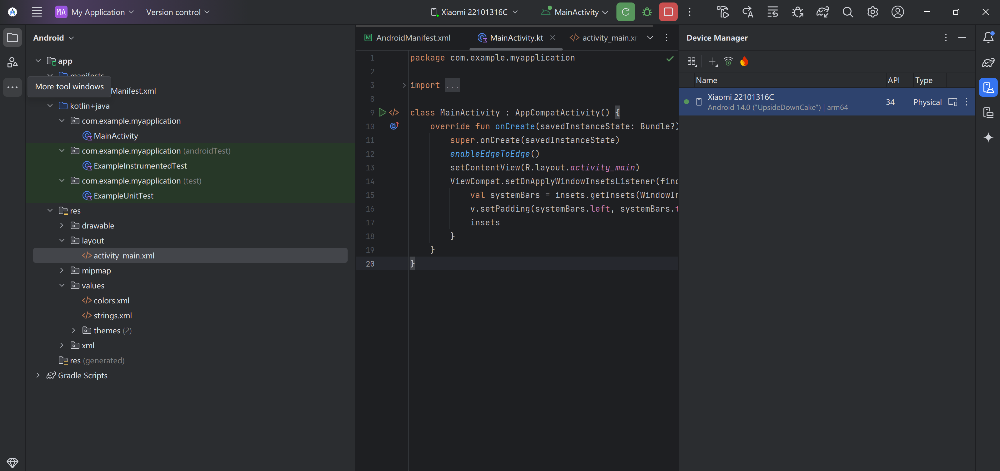
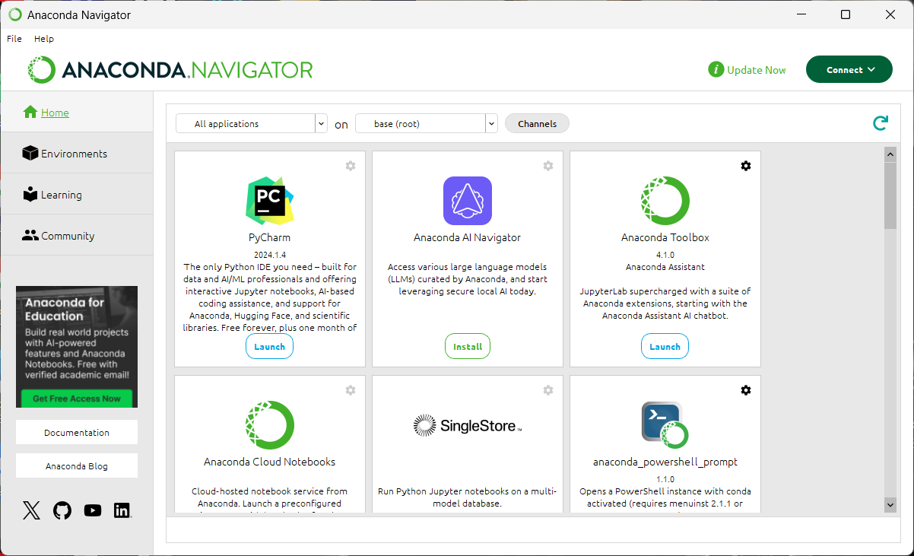
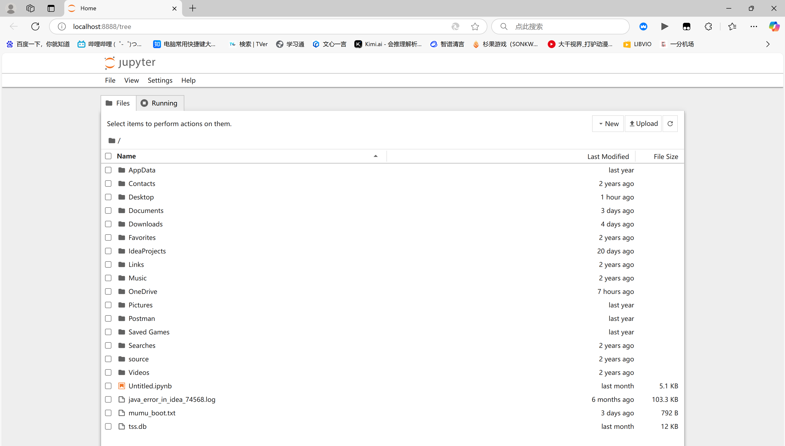

# 实验1：课程所需软件安装说明

## 一、实验概述
本次实验旨在安装课程所需的三类核心软件，为后续Android开发、机器学习模型构建及代码编辑提供环境支持。具体包括：
- Android Studio 4.1及以上版本（支持TensorFlow Lite）
- Jupyter Notebook及Python环境（通过Anaconda安装，首选方式）
- Visual Studio Code代码编辑器

## 二、软件安装步骤及效果展示

### 1. Android Studio安装
- **版本要求**：4.1以上，推荐最新版Android Studio Meerkat Patch 1，以更好支持TensorFlow Lite
- **注意事项**：
  - 依赖gradle工具，首次编译需下载大量组件，建议配置阿里云效Maven加速
  - 安装完成后需新建Android应用并编译运行，验证环境正确性
- **安装效果**：
    
  *图1：Android Studio成功启动后，显示项目结构及MainActivity.kt代码编辑界面*

### 2. Jupyter Notebook安装（Anaconda方式，首选）
- **Anaconda优势**：集成Python环境及数千个科学包，自带conda包管理工具，支持环境隔离
- **安装步骤**：
  1. 下载Anaconda并确保安装路径无中文、空格
  2. 选择"Just me"模式，勾选"Register Anaconda3 as default Python"
  3. 通过Anaconda Navigator或Anaconda Prompt验证安装（输入`conda list`查看已安装包）
- **启动方式**：通过Anaconda Navigator导航界面启动Jupyter Notebook
- **安装效果**：
  - Anaconda Navigator界面：  
      
    *图2：Anaconda Navigator主界面，可从中启动Jupyter Notebook等应用*
  
  - Jupyter Notebook运行界面：  
      
    *图3：Jupyter Notebook成功启动后，显示本地文件目录的网页界面（地址：localhost:8888/tree）*

### 3. Visual Studio Code安装
- **核心功能**：跨平台代码编辑器，支持插件扩展，适配Python、Jupyter等开发场景
- **必要插件**：Python、Jupyter、Jupyter Keymap
- **使用场景**：可创建和运行Jupyter Notebook，支持代码编辑与结果预览一体化

## 三、总结
本次实验完成了Android Studio、Anaconda（含Jupyter Notebook）及Visual Studio Code的安装与配置，三类软件分别对应：
- Android应用开发（Android Studio）
- 机器学习模型构建与数据分析（Jupyter Notebook）
- 多语言代码编辑（Visual Studio Code）

所有软件均已通过启动验证，界面正常显示，可满足后续课程实验需求。相关安装过程及截图已上传至GitHub/Gitee仓库。
